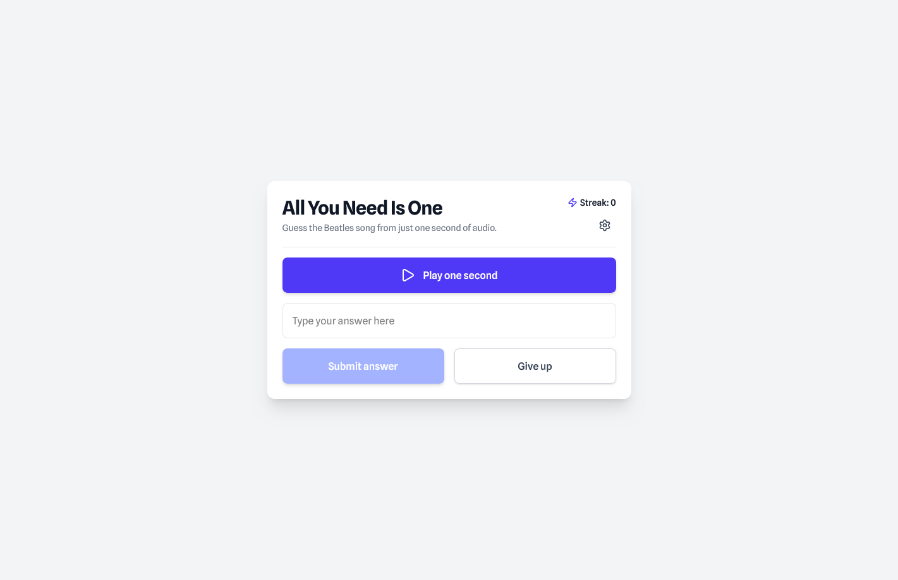
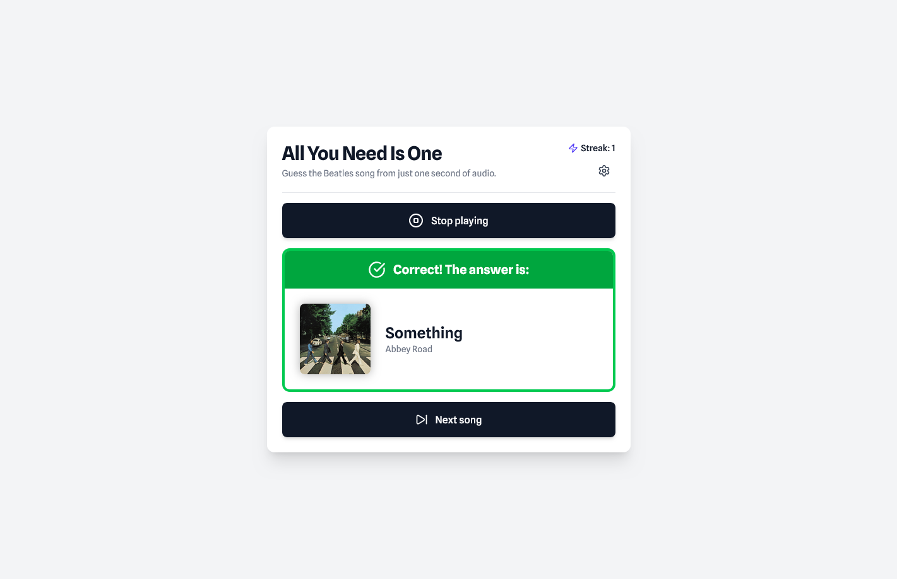

# All You Need Is One

## Overview

A simple web application where you hear one second of a Beatles song and try to identify it. It includes all 213 Beatles songs. Try the game here: [https://jarkmaen.github.io/all-you-need-is-one/](https://jarkmaen.github.io/all-you-need-is-one/)

#### The gameplay loop:

- Press "Play one second" to hear the audio snippet.
- Type your answer into the input field (it suggests song titles as you type).
- Submit your answer or press "Give up" if you don't know the answer.
- The result screen shows whether your answer was correct.
- Your streak increases on correct answers and resets to 0 on an incorrect answer or "Give up".
- Press "Next song" to continue with a new randomly selected song.

If you want an extra challenge, you can enable "Random mode" in the settings. Instead of always playing the first second, it will play a random one second snippet from anywhere in the song.

## Tech stack

- React
- Tailwind
- TypeScript
- react-player (for YouTube audio streaming)

## How to use

You can either play the game through the deployed link, or run the application locally. To run it locally, you need to have both [Git](https://git-scm.com/) and [Node.js](https://nodejs.org/) (which comes with [npm](https://www.npmjs.com/)) installed on your computer. From your terminal:

```
# Clone this repository and go to the root directory
$ git clone https://github.com/jarkmaen/all-you-need-is-one.git
$ cd all-you-need-is-one

# Go to the frontend directory and install dependencies
$ cd frontend
$ npm install

# Start the application
$ npm run dev
```

Once it is running, open http://localhost:5173 in your browser.

## Screenshots
| Answering view                               | Result view                                    |
| -------------------------------------------- | ---------------------------------------------- |
|  |          |
