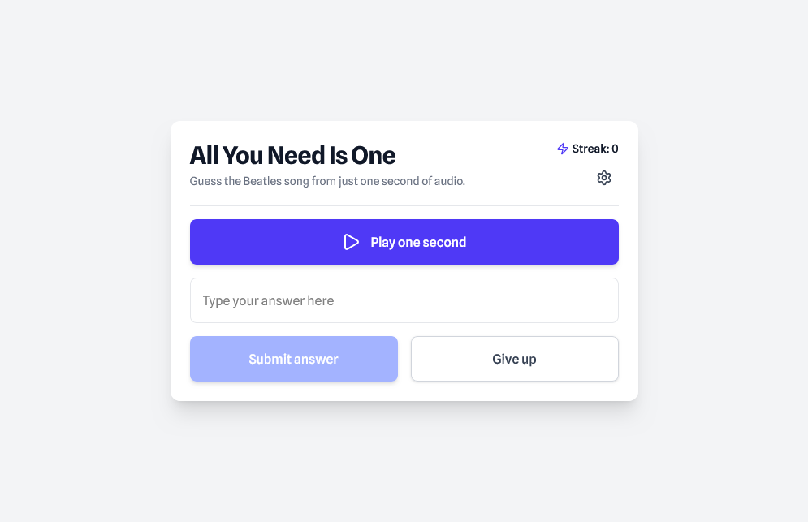
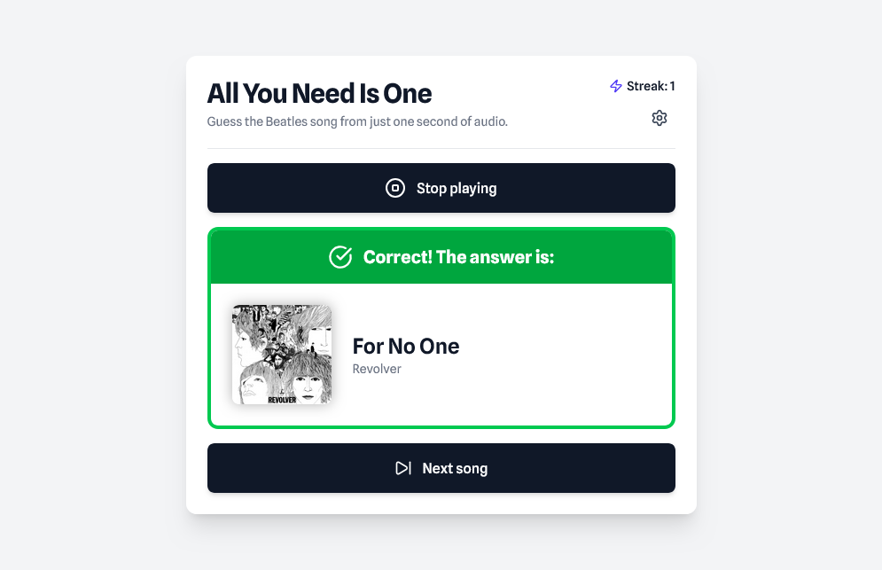

# All You Need Is One

## Overview

A simple web application where you hear one second of a Beatles song and try to identify it. All 213 Beatles songs are included.

Try the game here: [jarkmaen.github.io/all-you-need-is-one](https://jarkmaen.github.io/all-you-need-is-one)

Note: Since the audio is streamed through YouTube, an adblocker is highly recommended to prevent ads from interrupting the one second snippets.

#### The gameplay loop:

- Press "Play one second" to hear the audio snippet.
- Type your answer into the input field (song titles are suggested as you type).
- Submit your answer or press "Give up" if you don't know the answer.
- The result screen shows whether your answer was correct or not.
- Your streak increases by 1 on correct answers and resets to 0 on incorrect answers.
- Press "Next song" to hear the next randomly chosen song.

For an extra challenge, "Random mode" can be enabled in the settings. Instead of always playing the first second, a random one second snippet from anywhere in the song is played.

## Tech stack

- React
- Tailwind
- TypeScript
- react-player (for YouTube audio streaming)

## How to use

You can either play the game through the deployed link, or run it locally. To run it locally, you'll need to have both [Git](https://git-scm.com/) and [Node.js](https://nodejs.org/) (which comes with [npm](https://www.npmjs.com/)) installed on your computer. From your terminal:

```
# Clone this repository and go to the project directory
$ git clone https://github.com/jarkmaen/all-you-need-is-one.git
$ cd all-you-need-is-one

# Go to the frontend directory and install dependencies
$ cd frontend
$ npm install

# Start the application
$ npm run dev
```

Once it is running, open http://localhost:5173 in your browser.

## Screenshots

| Answering view                               | Result view                            |
| -------------------------------------------- | -------------------------------------- |
|  |  |
